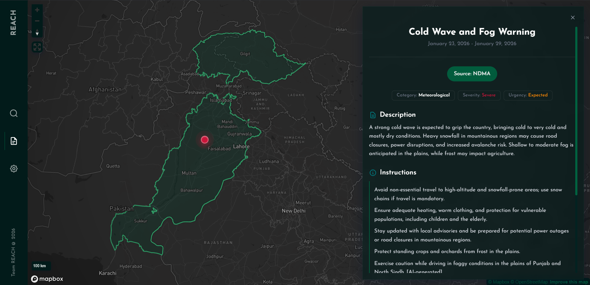
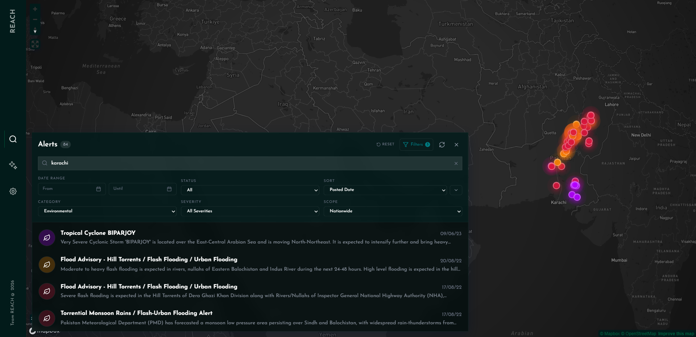
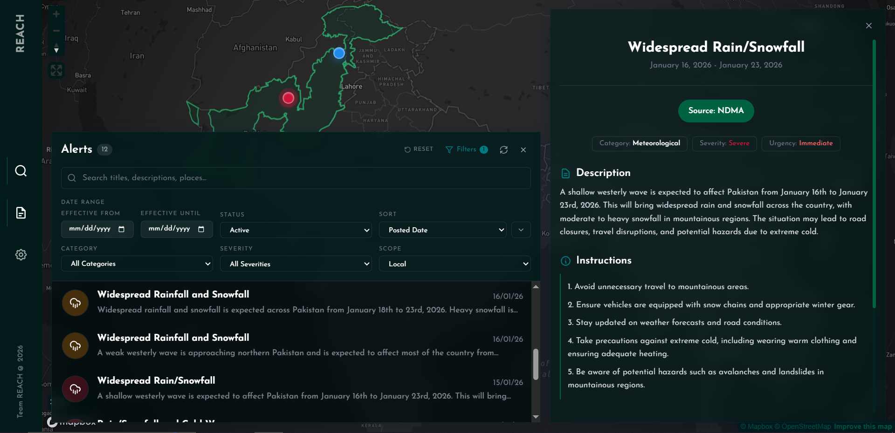
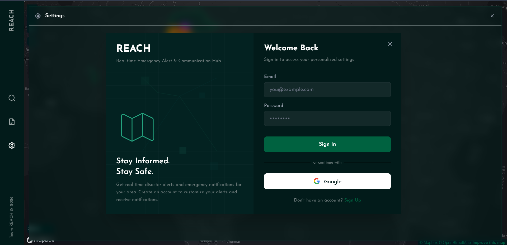

  

# REACH

  <b>Real-time Emergency Alert Collection Hub</b>

  An AI-powered warning system to bridge official disaster forecasts and the community in Pakistan.

  
  
  

 

##  The Problem
Pakistan faces a critical disconnect in its disaster management infrastructure. While agencies like NDMA and PMD generate vital data, the "last mile" of communication is broken.

<table width="100%">
  <tr>
    <td width="33%" valign="top">
      <h3 align="center"> Fragmentation</h3>
      
Critical alerts are scattered across isolated agencies, or locked inside static PDF bulletins.

    </td>
    <td width="33%" valign="top">
      <h3 align="center"> Latency & Jargon</h3>
      
Reports are often verbose, technical, and require manual parsing, leading to dangerous delays in dissemination. 

    </td>
    <td width="33%" valign="top">
      <h3 align="center"> Zero Targeting</h3>
      
Warnings are broadcast at the national level, causing alert fatigue. Faulty systems to deliver geofenced alerts.  

    </td>
  </tr>
</table>

 

##  The Solution
REACH is an automated pipeline that ingests raw government data and transforms it into precision-targeted, actionable alerts. We treat disaster alerts as **spatial data problems**, not just text problems.

### How it works

  

1.  **Ingestion:** Scrapers check bulletins (NDMA, NEOC, PMD) every 10 minutes for updates.
2.  **Normalization:** AI processes fetched documents in under 30 seconds to extract severity, timeline, description, etc. and convert it to a CAP (Common Alerting Protocol)-inspired schema.
3.  **Geocoding:** A custom service resolves location names to polygons. It handles complex directional variants (e.g., "North Khyber Pakhtunkhwa") using grid intersection logic over administrative boundaries.
4.  **Distribution:** Normalized data is stored in our database and served via web app for visualization and filtering.

 

##  Tech Stack
Our architecture is built for speed, resilience, and geospatial accuracy.

| **Component**            | **Technology**                                                                                                         | **Description**                                                                     |
| :----------------------- | :--------------------------------------------------------------------------------------------------------------------- | :---------------------------------------------------------------------------------- |
| **Frontend**             |                                          | React, TypeScript, and Mapbox for web app.                                          |
| **Services**             |                                             | Python microservices handling business logic and scraping.                          |
| **Backend and Database** |                                          | **Supabase** for storing alerts, geometries, cron jobs and message queues           |
| **AI Engine**            |  | Gemini-3-Flash for high-speed inference for document parsing and entity extraction. |

 

##  Visuals

|                               **Alert Polygon and Centroid Visualization**                               |                               **Searching Historical Alerts**                               |
| :-----------------------------------------------------------------------------------------: | :-----------------------------------------------------------------------------------------: |
|  |     |
|                                  **Filtering By Location**                                  |                                       **Signup Page**                                       |
|  |  |

 

##  Roadmap
- [x] **Scrapers:** Automated bots hitting NDMA, NEOC, and PMD public sources on a 10-minute cron
- [x] **AI Pipeline:** Document processing pipeline achieving <30s latency per report using Gemini 3 Flash
- [x] **Spatial Engine:** Heuristic geocoder capable of parsing admin regions and directional descriptors into polygons
- [x] **Web Dashboard:** A responsive React application for searching alerts, filtering by severity/date, and visualizing risk zones on an interactive map
- [ ] **Deduplication:** Logic to merge overlapping reports from different agencies into a single "Source of Truth" event
- [ ] **UX Polish:** Refining the dashboard based on early user feedback
- [ ] **Alerts:** Notifications for user apps based on their GPS location
- [ ] **Performance:** Optimizing database and backend for better performance
- [ ] **Mobile Apps:** Apps for Android and iOS to get information to all users conveniently
- [ ] **Advanced Geocoding:** Improving the heuristic engine to resolve roadways, hydrology (rivers/dams), and bridges
- [ ] **Data Expansion:** Integrating social media firehose (validated) and international weather APIs

 

##  Acknowledgements
- NDMA, NEOC, and PMD for their tireless work in disaster monitoring
- The open-source community for incredible tools and libraries
- Render, Modal, Supabase and Netlify for allowing us to host our app's services for free
- Communities affected by the 2025 floods - this is for you

 

  Built with  for a safer Pakistan.

